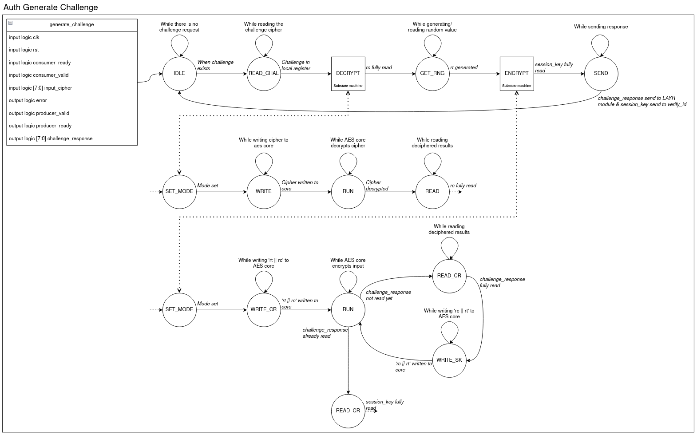
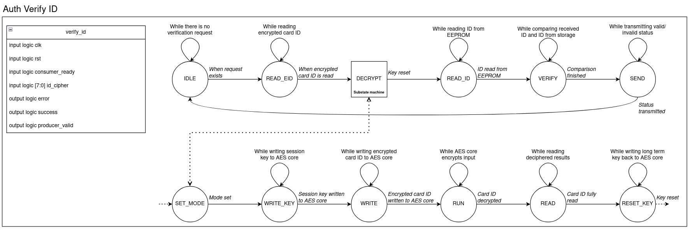
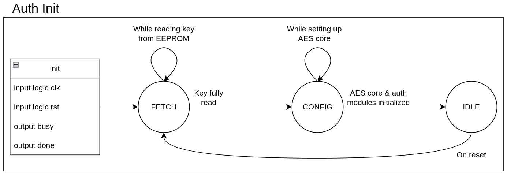

# Auth Controller

- [Interfaces](#Interfaces)
    - [auth](#auth)
    - [auth_generate_challenge](#auth_generate_challenge)
    - [auth_verify_id](#auth_verify_id)
    - [auth_init](#auth_init)

## Interfaces

> Notice: The state machines depicted in the figures stem from the planning phase and may not necessarily reflect the current state of the application perfectly.

### auth

This is the wrapper module for all below functionality.
It provides a simple interface for interaction with the authentication functionality.

The IO-bus of 128 bit in each direction enables single-cycle reads/writes in both directions, as this is the maximum size of
data to be transmitted to and from the module.

There are two operations required for the LAYR protocol: `generate_challenge` and `verify_id`.
The respective operation can be selected with the single bit input `operation_i`.
Once the input has been set on `data_i`, the operation can be started by setting `start_i` to true.

Inputs:

| Name & Type | Comment |
|-------------|---------|
| `input wire clk` | Clock |
| `input wire rst` | Reset |
| `input wire operation_i` | Which operation to perform. |
| `input wire start_i` | Trigger the selected operation. |
| `input reg [127:0] data_i` | Bus for input data. |

Outputs:

| Name & Type | Comment |
|-------------|---------|
| `output wire valid_o` | Specifies whether the output data is ready to be read. |
| `output reg [127:0] data_o` | Bus for the output data. |

---

### auth_generate_challenge

This module reads the encrypted `AUTH_INIT`, decrypts it, then generates
a challenge response and sends it to the card.

For data transmissions, a ready(valid handshake system is used.
This essentially means that the producer waits for both the
`valid` and `ready` flags to be send and then writes the next
set of output bytes to the corresponding bus.

The received rc and rt values are stored in 64 bit registers (flipflops)
until they are consumed by `verify_id` or overwritten.

Inputs:

| Name & Type | Comment |
|-------------|---------|
| `input logic clk` | Clock |
| `input logic rst` | Reset |
| `input logic external_ready` | Ready/Valid handshake component. |
| `input logic external_valid` | Ready/Valid handshake component. |
| `input logic [7:0] input_cipher` | The data send by the cards `AUTH_INIT`, send byte by byte. |

Outputs:

| Name & Type | Comment |
|-------------|---------|
| `output logic error` | Flag to indicate authentication failure. |
| `output logic invalid_valid` | Ready/Valid handshake component. |
| `output logic invalid_ready` | Ready/Valid handshake component. |
| `output logic [7:0] challenge_response` | The generated challenge, send byte by byte. |

---

### auth_verify_id

This module receives an ID encrypted with a session key, decrypts it and
verifies that it is allowed to access the lock. The values rc and rt needed
for calculating the session key are read from two 64 bit registers.

Inputs:

| Name & Type | Comment |
|-------------|---------|
| `input logic clk` | Clock |
| `input logic rst` | Reset |
| `input logic external_valid` | Ready/Valid handshake component. |
| `input logic [7:0] id_cipher` | The encrypted ID of the cardy, send byte by byte. |

Outputs:

| Name & Type | Comment |
|-------------|---------|
| `output logic error` | Flag to indicate authentication failure. |
| `output logic success` | Flag to indicate authentication success. |
| `output logic internal_ready` | Ready/Valid handshake component. |

---

### auth_init

This is a small state machine that ensures the AES core is properly initialized both on first power up as well as on reset.

Inputs:

| Name & Type | Comment |
|-------------|---------|
| `input logic clk` | Clock |
| `input logic rst` | Reset |

Outputs:

| Name & Type | Comment |
|-------------|---------|
| `output logic busy` | Since initialization likely takes longer then one clock cycle, this flag indicates that the init process is still ongoing. |
| `output logic done` | Flag to indicate that init of the AES core is done. |
