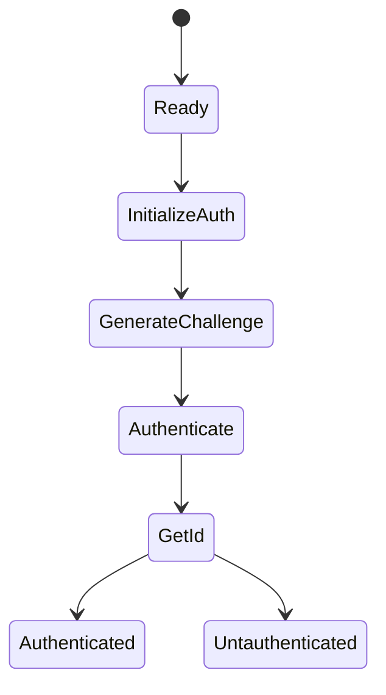
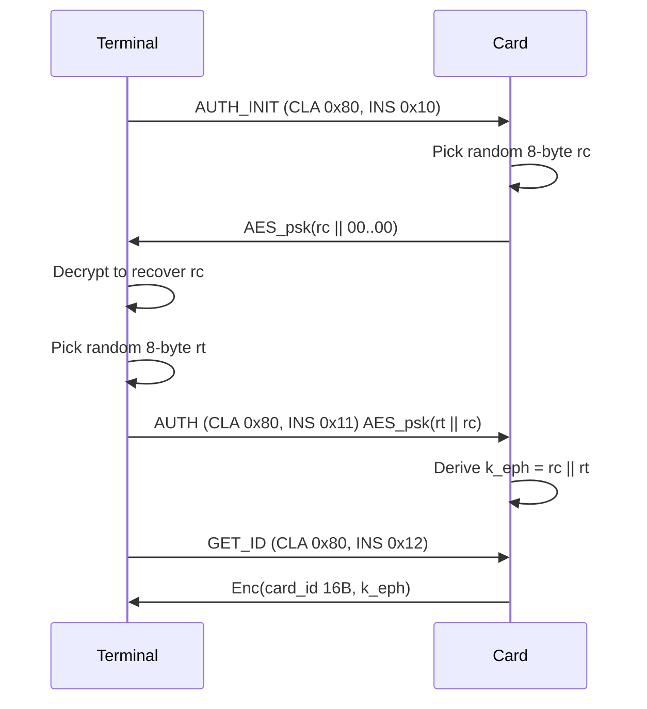

```mermaid
stateDiagram
    [*] --> Ready
    Ready --> InitializeAuth
    InitializeAuth --> GenerateChallenge
    GenerateChallenge --> Authenticate
    Authenticate --> GetId
    GetId --> Authenticated
    GetId --> Untauthenticated
```

# Sequence

```mermaid
sequenceDiagram
    participant T as Terminal
    participant C as Card

    %% AUTH_INIT
    T->>C: AUTH_INIT (CLA 0x80, INS 0x10)
    C->>C: Pick random 8-byte rc
    C->>T: AES_psk(rc || 00..00)

    %% AUTH
    T->>T: Decrypt to recover rc
    T->>T: Pick random 8-byte rt
    T->>C: AUTH (CLA 0x80, INS 0x11) AES_psk(rt || rc)

    %% GET_ID
    C->>C: Derive k_eph = rc || rt
    T->>C: GET_ID (CLA 0x80, INS 0x12)
    C->>T: Enc(card_id 16B, k_eph)
```

