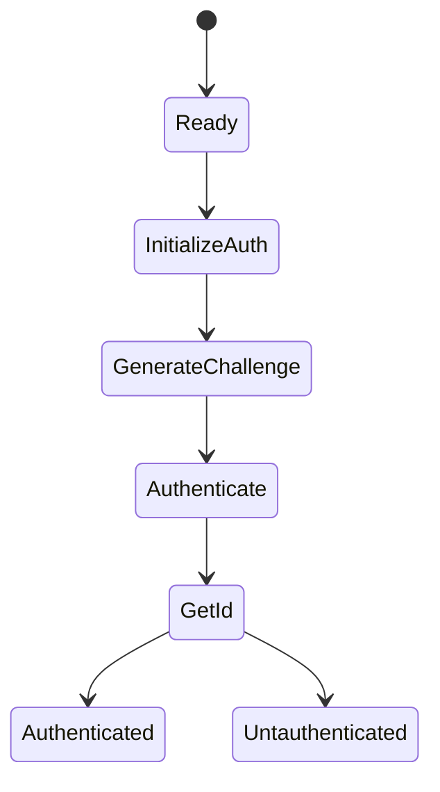
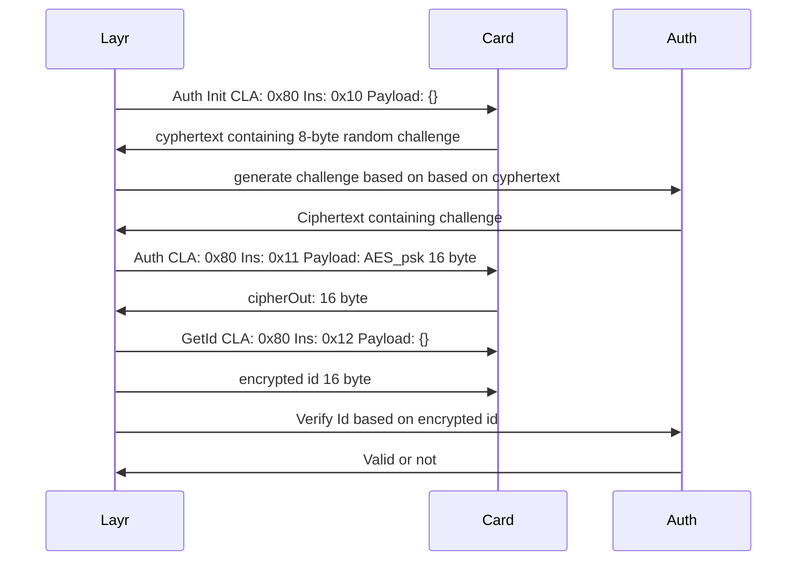

```mermaid
stateDiagram
    [*] --> Ready
    Ready --> InitializeAuth
    InitializeAuth --> GenerateChallenge
    GenerateChallenge --> Authenticate
    Authenticate --> GetId
    GetId --> Authenticated
    GetId --> Untauthenticated
```

# Sequence

```mermaid
sequenceDiagram
    Layr->>Card: Auth Init CLA: 0x80 Ins: 0x10 Payload: {}
    Card->>Layr: cyphertext containing 8-byte random challenge

    Layr->>Auth: generate challenge based on based on cyphertext
    Auth->>Layr: Ciphertext containing challenge

    Layr->>Card: Auth CLA: 0x80 Ins: 0x11 Payload: AES_psk 16 byte
    Card->>Layr: cipherOut: 16 byte
    Layr->>Card: GetId CLA: 0x80 Ins: 0x12 Payload: {}
    Layr->>Card: encrypted id 16 byte

    Layr->>Auth: Verify Id based on encrypted id
    Auth->>Layr: Valid or not
```

