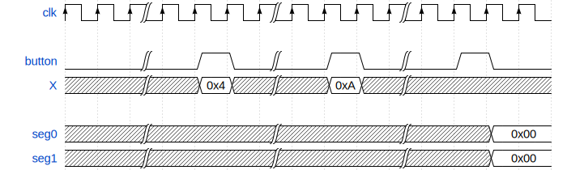

# Student Instructions – Mini Calculator ASIC

## Goal

Design a small digital ASIC Chip implementing a mini adder controlled by a single button and a finite state machine (FSM).

The system sequentially captures two 4-bit operands, computes their sum, and displays the result on two 7-segment displays.

The control button is considered ideal, meaning it produces a single-clock-cycle pulse synchronized to clk (see below).

## External Interface

### Inputs

1. `clk` - System clock
2. `rst_n` - Active-low synchronous reset (High value means no reset)
3. `button` - Ideal button: synchronized, debounced, single-cycle pulse
4. `X[4:0]` - 4-bit input bus

### Outputs

1. `seg0[6:0]` - 7-segment display for first digit (4-bit value, active-low)
2. `seg1[6:0]` - 7-segment display for last digit (4-bit value, active-low)

## Functional Behavior

The system operates in a sequential manner using a simple FSM and a single control button. The intended usage sequence is:

1. The user sets the input bus in[3:0] to operand A
2. The user presses the control button → operand A is stored
3. The user sets the input bus in[3:0] to operand B
4. The user presses the control button → operand B is stored
5. The system computes A + B
6. On the next button press, the system display is updated to show the result, and operation returns to step 1

This sequence repeats indefinitely.

## Example Waveform

The waveform below shows how chip will work:

## Functional Behavior

The system is based on a circular FSM. Each press of `button` captures the current input and advances the state.
Two 7-segment displays show the complete values in hexadecimal form (two hex digits).

**Initial State:** Upon reset (`rst_n` = 0), the FSM must initialize to the `GET_A` state.

### FSM sequence

1. `GET_A`
    - When `button` is pressed: capture the current value of `X[4:0]` into a register, advance to `GET_B`.

2. `GET_B`
    - When `button` is pressed: capture the current value of `X[4:0]` into another register, advance to `SHOW_RESULT`

3. `SHOW_RESULT`
    - When `button`is pressed: change the display value, which is stored in a register, return to `GET_A`.

The FSM always progresses forward; no backward navigation or editing is required.

## Specifications

### Button Specification

The `button` signal is considered IDEAL, meaning:
- Already synchronized to the `clk` domain
- Already debounced (no mechanical bouncing)
- Produces exactly **one** clock cycle pulse per button press
- No additional debouncing or edge detection circuitry is required

### Display Specification

**Two** 7-segment displays are used:
  * `seg0[6:0]`: displays the first value (bits 3:0)
  * `seg1[6:0]`: displays the last value (bits 7:4)
  * `seg` encoding: `seg[6:0] = {a, b, c, d, e, f, g}` (alphabetical order)

### Reset Specification

- `rst_n` is active-low and synchronous
- When `rst_n` = 0: system initializes to `GET_A` state with all registers cleared
- When `rst_n` = 1: normal operation

## Architecture

The chip architecture is shown in the following.

The main data path consists of the following modules:

- `adder`: stores the operands and computes the result
- `bcd_convert`: convert the result to two BCD values
- `seven_segment`: convert BCD value to seven segment (and stores the last one)
- `controller`: controls the operation based on the button pushes